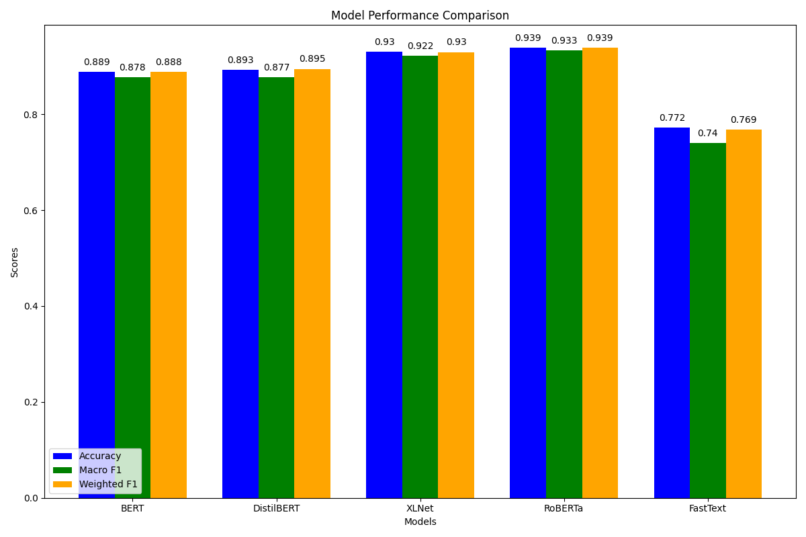

# 🙂 Sentiment Classification on Product Reviews

Development and comparison of five NLP models, FastText, BERT, DistilBERT, RoBERTa, and XLNet to classify product reviews as positive or negative, using pre-trained transformer architectures and fine-tuning techniques.

## 📚 Dataset
The project uses the Customer Review (CR) Dataset from the [SentEval benchmark](https://github.com/facebookresearch/SentEval), commonly used for sentiment classification tasks.
* Contains short product reviews labeled as either positive or negative.
* Approximately 2000 examples split evenly between classes.
* Originally collected and prepared by Hu and Liu (2004) for opinion mining research.
  
Format:
* ```custrev.pos```: Positive review snippets (one per line)
* ```custrev.neg```: Negative review snippets (one per line)

## ⚒️ Setup

### 1. Preprocessing
* Combines ```custrev.pos``` and ```custrev.neg``` from the Customer Review Dataset.
* Labels: 1 (positive), 0 (negative)
* Outputs train/test splits to ```train_data.csv``` and ```test_data.csv```

### 2. Model Training
* Five models are trained to classify sentiment.
  * FastText
  * BERT (`bert-base-uncased`)
  * DistilBERT (`distilbert-base-uncased`)
  * RoBERTa (`roberta-base`)
  * XLNet (`xlnet-base-cased`)
* FastText is trained on the preprocessed .txt format of the data.
* Transformer-based models are fine-tuned using:
  * Tokenization (padding, truncation to max length 512)
  * AdamW optimizer
  * CrossEntropyLoss
  * 5 training epochs with batch size 8
* Training times are saved to `results/training_time.csv`.

### 3. Evaluation
* Predictions are made on the test set
* Evaluation metrics:
  * Accuracy
  * Macro F1 Score
  * Weighted F1 Score
* Results are saved to `results/model_predictions.csv`.
* Visual comparison in `images/class_compare.png`.

## 📊 Results & Visualizations
* RoBERTa achieved the highest scores, closely followed by XLNet and DistilBERT. FastText, while faster to train, underperformed compared to transformer-based models.



## 🗂️ Project Structure
```
.
├── data/CR/                 # Dataset files (raw and preprocessed)
│   ├── custrev.neg
│   ├── custrev.pos
│   ├── train_data.csv
│   └── test_data.csv
├── images/                  # Visualizations
│   └── class_compare.png
├── results/                 # Evaluation outputs
│   ├── model_predictions.csv
│   └── training_time.csv
├── utils/                   # Utility scripts
│   ├── evaluate.py          # Model evaluation (accuracy, macro-F1, etc.)
│   ├── models.py            # Model loading, training, saving
│   └── preprocess.py        # Dataset preprocessing and loading
├── .gitignore
├── README.md
├── main.py                  # Script to run full pipeline
├── main.ipynb               # Jupyter notebook version for exploration
└── train.py                 # Training workflow
```

## Citation
Minqing Hu and Bing Liu. 2004. Mining and summarizing customer reviews. In Proceedings of the tenth ACM SIGKDD international conference on Knowledge discovery and data mining (KDD '04). Association for Computing Machinery, New York, NY, USA, 168–177. https://doi.org/10.1145/1014052.1014073

## 👩🏽‍💻 Creator
Glory Odeyemi - Data Engineer & Analyst
- For questions, feedback, opportunities, or collaborations, connect with me via [LinkedIn](https://www.linkedin.com/in/glory-odeyemi/).
- For more exciting projects or inspiration, check out my [GitHub repositories](https://github.com/gloryodeyemi).
